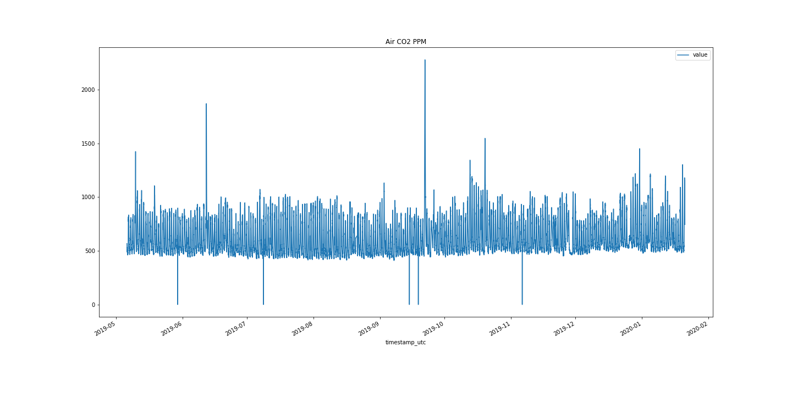
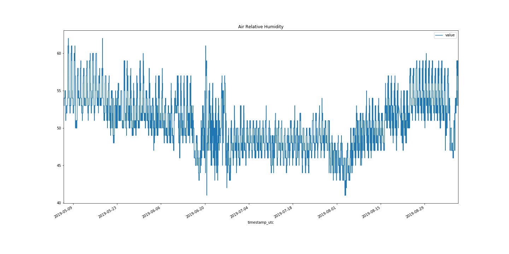
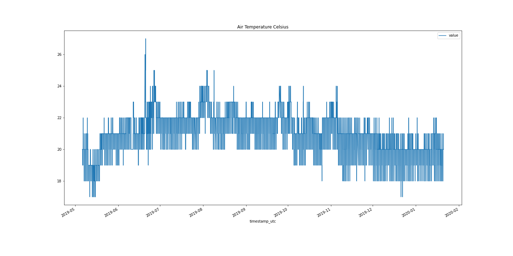
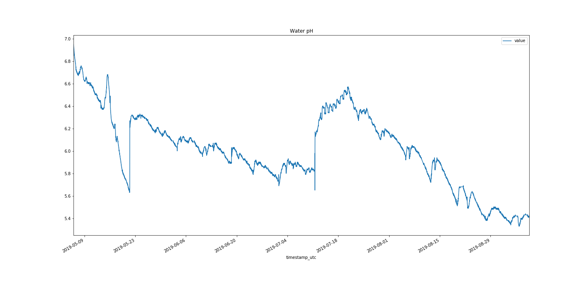
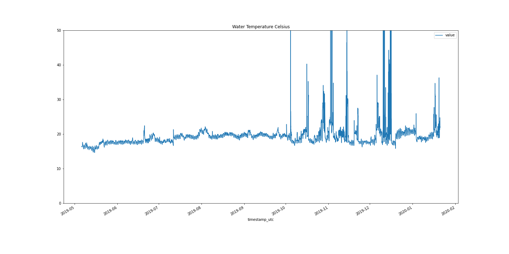

This repository contains data collected from a single Open Agriculture Personal Food Computer, that has been running at the Cooper Hewitt Musuem since May, 2019.

## Timelapse
[timelapse.mp4](timelapse.mp4)
A timelapse MP4 created from images collected between 2019-05-06 11:07:01 UTC and 2019-09-08 09:03:12 UTC

## Data 
You'll find a raw download of the data from our Google BigQuery backend in the `raw_data` directory. 

In the `data` directory you'll find the data split out into individual CSV files. The python script that was used to do that is the `split_raw_data.py` file.

Here are some stats on the split out data:
| filename | datapoints | Max Val | Min Val | Median Val |
| ----------- | -------------- | ----------- | --------- | --------------- |
| air_carbon_dioxide_ppm_T6713-Top.csv | 35347 | 1871 | 0 | 540 |
| air_humidity_percent_SHT25-Top.csv | 35347 | 62 | 41 | 50 |
| air_temperature_celcius_SHT25-Top.csv | 35349 | 27.0 | 17.0 | 21.0 | 
| water_electrical_conductivity_ms_cm_AtlasEC-Reservoir.csv | 35358 | 26.1 | 0.0 | 10.8 | 
| water_potential_hydrogen_AtlasPH-Reservoir.csv | 35360 | 6.95 | 5.33 | 6.01 | 
| water_temperature_celcius_AtlasTemp-Reservoir.csv | 35364 | 22.46 | 14.64 | 18.59 | 

## Python Jupyter Notebook
In the `notebooks` directory you'll find a Jupyter notebook that was used to produce some graphs of the data. You can see the HTML output in the  [data_process.html file](data_process.html). [(You can also get it in PDF form)](data_process.pdf)

## Visualizations

")

