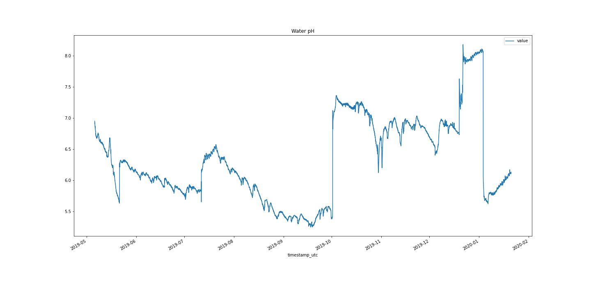

This repository contains data collected from a single Open Agriculture Personal Food Computer, that has been running at the Cooper Hewitt Museum since May, 2019.

## Time-lapse

A time lapse MP4 created from images collected between 2019-05-06 11:07:01 UTC and 2019-09-08 09:03:12 UTC.
The images were downloaded using `wget` from the URLs in the `data/Camera-Top_URL.csv` file, and then `ffmpeg` was used to create the timelapse mp4.

##### mp4 file:
[timelapse.mp4](timelapse.mp4)

##### YouTube Version of the Time-lapse:

## Data 
You'll find a raw download of the data from our Google BigQuery backend in the `raw_data` directory. 

In the `data` directory you'll find the data split out into individual CSV files. The python script that was used to do that is the `split_raw_data.py` file.
(Note there was a spelling error in our data processing code, hence `celcius`)
Here are some stats on the split out data:

| filename | datapoints | Max Val | Min Val | Mean Val | Standard Dev |
| ----------- | -------------- | ----------- | --------- | --------------- | ----- |
| air_carbon_dioxide_ppm_T6713-Top.csv | 73069 | 2279 | 0 | 624.95 | 168.51  |
| air_humidity_percent_SHT25-Top.csv | 73072 | 65 | 41 | 53.14 | 4.38 |
| air_temperature_celcius_SHT25-Top.csv | 73074 | 27.0 | 17.0 | 20.91 | 1.39 | 
| water_electrical_conductivity_ms_cm_AtlasEC-Reservoir.csv | 73078 | 26.1 | 0.0 | 10.46 | 6.01 |
| water_potential_hydrogen_AtlasPH-Reservoir.csv | 73080 | 8.18 | 5.25 | 6.33 | 0.68 | 
| water_temperature_celcius_AtlasTemp-Reservoir.csv | 73084 | 779.43 | 14.64 | 19.7 | 14.57 |

There are obvious errors in the data, such as the water temperature reaching 779 degrees C, well above the boiling point. 

## Python Jupyter Notebook
In the `notebooks` directory you'll find a Jupyter notebook that was used to produce some graphs of the data. You can see the HTML output in the  [data_process.html file](data_process.html). [(You can also get it in PDF form)](data_process.pdf)

## Visualizations

")

